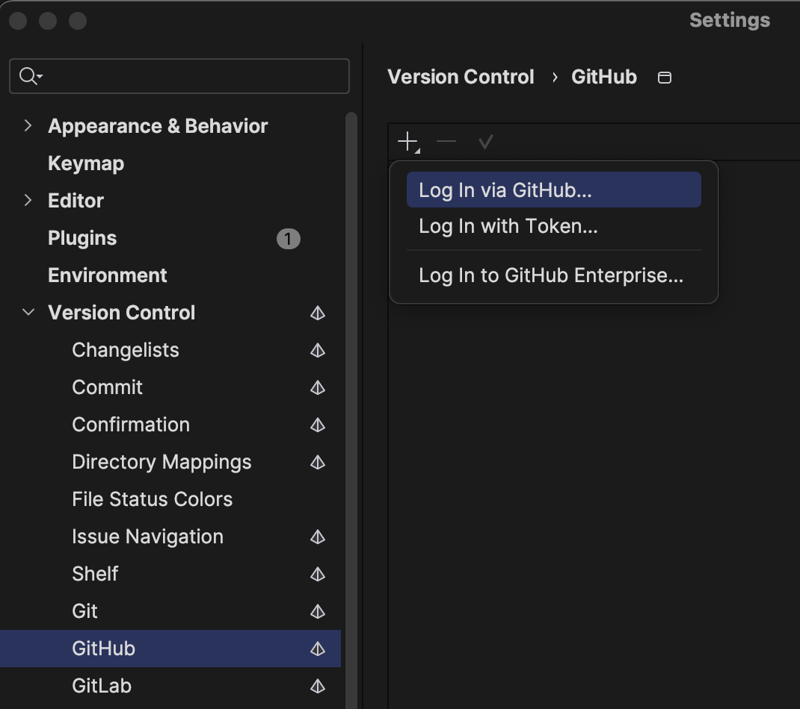
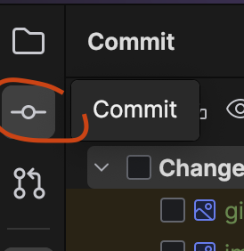
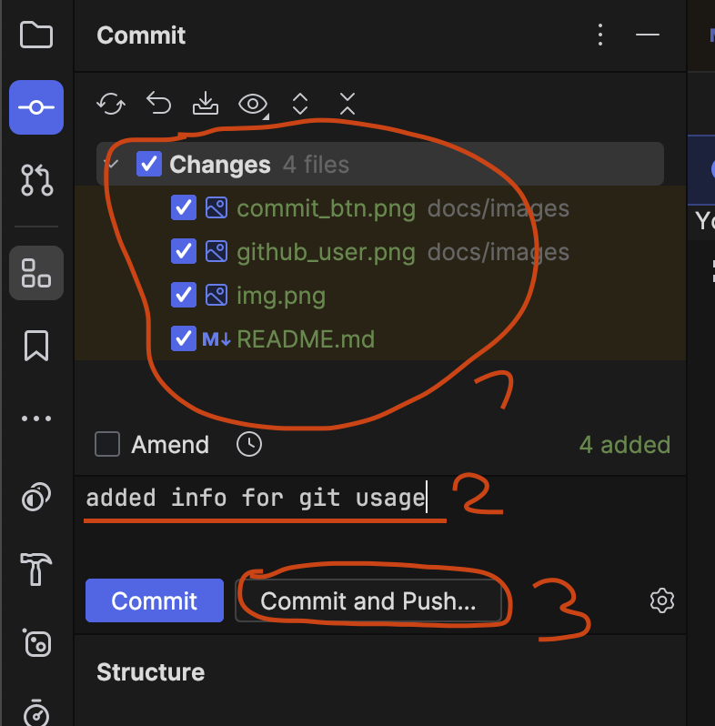

# Sticky Trigger

## How to git?
* __clone this git repository__
  * [official guide](https://docs.github.com/de/repositories/creating-and-managing-repositories/cloning-a-repository)
  * open a terminal in the folder you want to save the project folder to
    * [how to](https://www.groovypost.com/howto/open-command-window-terminal-window-specific-folder-windows-mac-linux/)
  * type `git clone` followed by the link to this repository
    * this should automatically create a folder and download everything into that folder
  * open the folder as a project in Unity and/or Rider
* __add your github user in Rider__
  * open Settings/Preferences -> Version Controll -> GitHub and press the + icon 
* __upload (commit and push) changes in Rider__
  * open the commit tab on the left 
  * select which changes you want to upload
  * add a descriptive(!) commit message of what you did
  * press "Commit and Push..." 